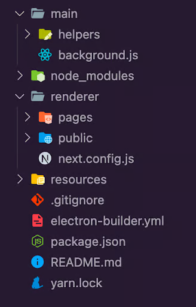

## What are the advantages of Electron.js?

- Cross-platform: Electron allows you to create applications for major operating systems, such as Windows, macOS, and Linux
- Easy to use: If you have basic HTML, CSS, and JavaScript knowledge, you’ll find it easy to get started creating an Electron application
- Desktop API: Electron enables you to easily access desktop/hardware APIs using web technologies you’re already familiar with

## The file structure for a Nextron project



All the Next.js-related code is located inside the /render folder. Some other files and directories that you might not be familiar with include:

- main/helpers: This directory exports a module called createWindow, which uses Electron’s BrowserWindow function to create our desktop application window. We can configure the default app window options here, such as its initial size and position
- main/background.js: This file is where the createWindow function is initialized and is responsible for serving our Next.js application as an Electron application
- resources/: Here, we can put our desktop application resources, such as app icons

## Electron APIs

Browser-based APIs and the Electron APIs work graciously too, and you can directly import them into any page. An example is the browser notification API, which we can utilize on a page like below:
```ts
const showNotification = () => {
    const notificationTitle = "My Notification 🔔";
    console.count("Start Notify");
    new Notification(notificationTitle, {
      body: "This is a sample notification.",
      renotify: true,
      tag: "test",
    }).onclick = () => console.log("Notification Clicked");
  };
```
And any time we perform an action that triggers the showNotification function, we’ll immediately get a notification on our desktop.

## Nextron webpack processes

Nextron applications via Next.js run on two different webpack processes, namely the client process and server process. With this in mind, it’s critical to determine which process you’re in, especially if you intend to use libraries that don’t support server-side rendering.

You should check if the current process is server or client. According to the Nextron documentation, here’s the recommended syntax for checking this for an Electron module:

```ts
const Home = () => {
  if (typeof window !== "undefined") {
    // your client side code goes here --> eg: alert("YAY")
  };
export default Home;
```

Optionally, you can leverage React’s useEffect() Hook and the browser’s window to check if you’re currently on the client process, like so:

```ts
import { useEffect } from "react";

const Home = () => {
  useEffect(() => {
    // your client side code goes here --> eg: alert("YAY")
  }, []);
};
export default Home;
```

## Building a demo app

You can update the script section in your package.json file to include other build options:

```json
{
  "scripts": {
    "build": "nextron build",
    "build:all": "nextron build --all",
    "build:win32": "nextron build --win --ia32",
    "build:win64": "nextron build --win --x64",
    "build:mac": "nextron build --mac --x64",
    "build:linux": "nextron build --linux"
  }
}
```

## Best security practices for Electron and Next.js apps
When developing Electron and Next.js applications, you have to pay attention to the security needs of both frameworks to ensure the safety and integrity of your application. Here are some security best practices to consider:

Enable Node.js integration selectively: By default, Node.js integration is disabled in Electron for enhanced security. Only enable it for specific renderer processes that require Node.js APIs
Content Security Policy (CSP): Implement a robust CSP to restrict what scripts, styles, and resources can be loaded within your application’s renderer processes. This helps prevent malicious code injection and improves overall security
Use context isolation: Context isolation is a security feature in Electron that creates a separate context for each renderer process, preventing cross-site scripting (XSS) attacks and other potential security vulnerabilities
Secure IPC communication: Electron uses inter-process communication (IPC) for communication between the main and renderer processes. Sanitize and validate data carefully before sending it through IPC channels to prevent unauthorized access or code execution
Secure headers and middleware: Implement secure HTTP headers (e.g., X-XSS-Protection, X-Frame-Options, Content-Security-Policy) using Next.js middleware or custom server middleware
HTTPS everywhere: Enforce HTTPS for all communication between your Next.js application and the server. This encrypts data transmission, protecting it from eavesdropping and tampering
Server-side rendering (SSR) with caution: While SSR offers SEO benefits, be mindful of potential XSS (Cross-Site Scripting) vulnerabilities if user-controlled data is directly rendered on the server. Sanitize all user input before including it in the SSR output.
